# Spring Security Learning — Basic to Advanced

A comprehensive multi-module Maven project covering every major concept in Spring Security, from basic in-memory authentication to JWT, OAuth2, and method-level security.

---

## Table of Contents

1. [Architecture Overview (HLD)](#1-architecture-overview-hld)
2. [Spring Security Filter Chain (Core Internals)](#2-spring-security-filter-chain-core-internals)
3. [Authentication Architecture (Class Diagram)](#3-authentication-architecture-class-diagram)
4. [Module 1 — Basic Security](#4-module-1--basic-security)
5. [Module 2 — JDBC Authentication & Custom UserDetailsService](#5-module-2--jdbc-authentication--custom-userdetailsservice)
6. [Module 3 — JWT Authentication](#6-module-3--jwt-authentication)
7. [Module 4 — OAuth2 / OpenID Connect](#7-module-4--oauth2--openid-connect)
8. [Module 5 — Method Security, CORS, Exception Handling](#8-module-5--method-security-cors-exception-handling)
9. [Module 6 — JWT Signing Algorithms, Refresh Tokens, OAuth2 Grant Types](#9-module-6--jwt-signing-algorithms-refresh-tokens-oauth2-grant-types)
10. [Module 7 — Advanced Security: Brute Force, Role Hierarchy, Security Headers, Audit](#10-module-7--advanced-security)
11. [Security State Diagram](#11-security-state-diagram)
12. [CSRF Protection](#12-csrf-protection)
13. [Password Encoding](#13-password-encoding)
14. [Quick Reference](#14-quick-reference)
15. [Running Each Module](#15-running-each-module)

---

## 1. Architecture Overview (HLD)

Spring Security works as a **servlet filter chain** that wraps the entire Spring MVC application.


<details>
<summary>📐 PlantUML Source</summary>

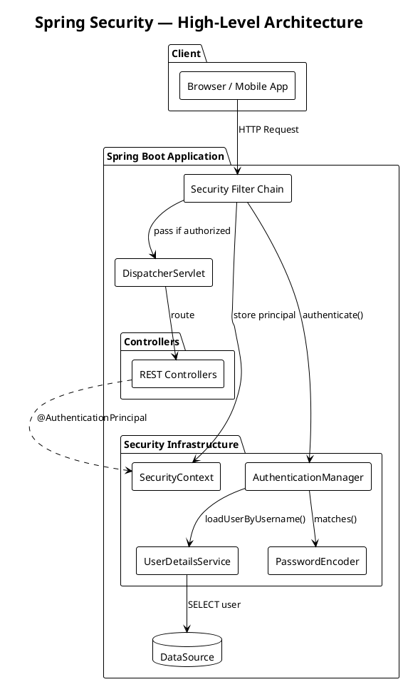

</details>

---

## 2. Spring Security Filter Chain (Core Internals)


<details>
<summary>📐 PlantUML Source</summary>

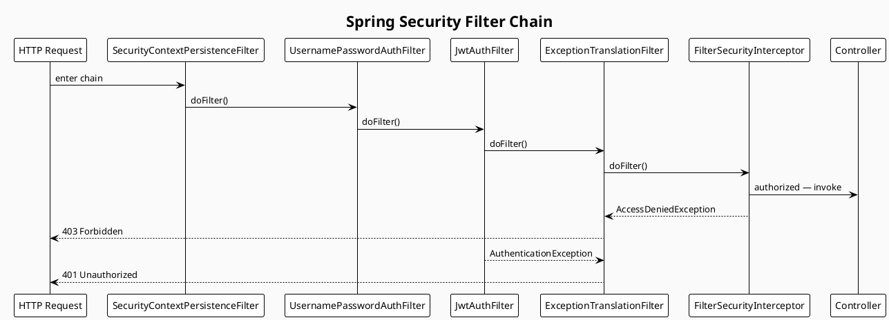

</details>

### Key Insight: Filter Order Matters

Filters are evaluated **in order, top to bottom**. The first filter that handles the request (e.g., JWT filter) sets the `Authentication` in the `SecurityContext`. Later filters see the already-populated context.

---

## 3. Authentication Architecture (Class Diagram)


<details>
<summary>📐 PlantUML Source</summary>

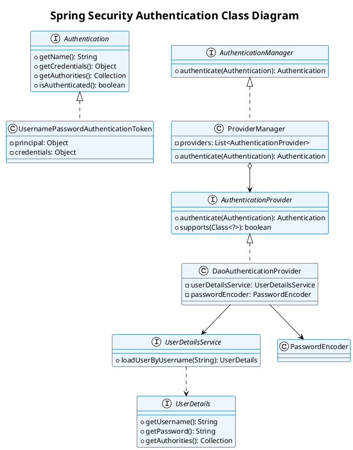

</details>

---

## 4. Module 1 — Basic Security

**Location:** `module1-basic-security/` | **Port:** `8081`

### Concepts Covered
- In-Memory Authentication (`InMemoryUserDetailsManager`)
- Form-Based Login with custom login page
- HTTP Basic Authentication
- Role-based access control in `SecurityFilterChain`
- Remember-Me authentication
- Thymeleaf `sec:authorize` tags

### Sequence Diagram — Form Login


<details>
<summary>📐 PlantUML Source</summary>

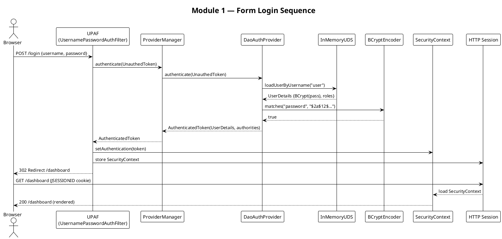

</details>

### Sequence Diagram — HTTP Basic


<details>
<summary>📐 PlantUML Source</summary>

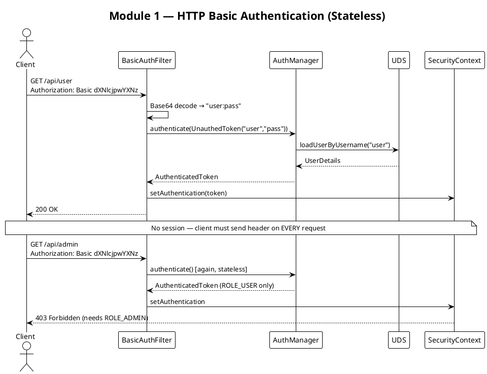

</details>

### Key Configuration Differences

| Feature | Form Login | HTTP Basic |
|--------|-----------|------------|
| Authentication mechanism | POST /login form | Authorization: Basic header |
| Session | Stateful (JSESSIONID) | Stateless |
| Logout | POST /logout | N/A (clear credentials) |
| Browser dialog | Custom HTML page | Native browser dialog |
| CSRF protection | Required | Not needed (stateless) |
| Use case | Web applications | REST APIs, microservices |

---

## 5. Module 2 — JDBC Authentication & Custom UserDetailsService

**Location:** `module2-jdbc-auth/` | **Port:** `8082`

### Concepts Covered
- Custom `UserDetailsService` with JPA/H2
- `DaoAuthenticationProvider` wiring
- Password encoding on registration
- `AuthenticationManager` bean exposure
- Role hierarchy via many-to-many relationship

### LLD — UserDetailsService Class Diagram


<details>
<summary>📐 PlantUML Source</summary>

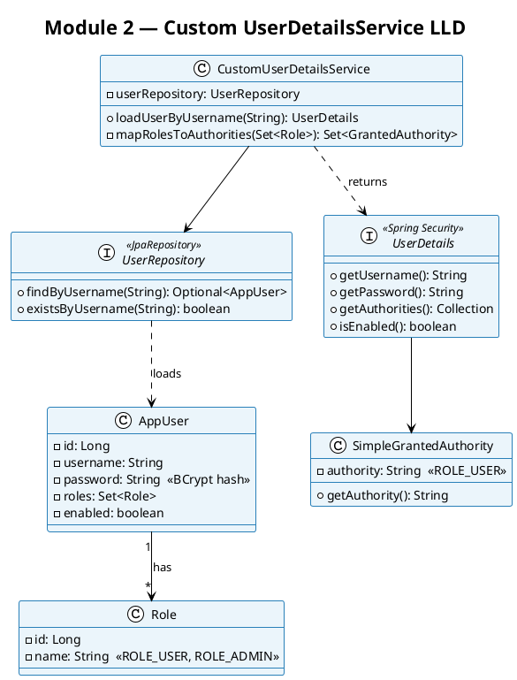

</details>

### Database Schema

```
app_users                    user_roles               roles
─────────────────────        ─────────────            ──────────────────
id          BIGINT PK        user_id BIGINT FK   →   id    BIGINT PK
username    VARCHAR UNIQUE   role_id BIGINT FK        name  VARCHAR UNIQUE
password    VARCHAR          (many-to-many join)      (ROLE_USER, ROLE_ADMIN)
enabled     BOOLEAN
account_non_expired  BOOL
account_non_locked   BOOL
credentials_non_expired BOOL
```

### Sequence Diagram — JDBC Authentication


<details>
<summary>📐 PlantUML Source</summary>

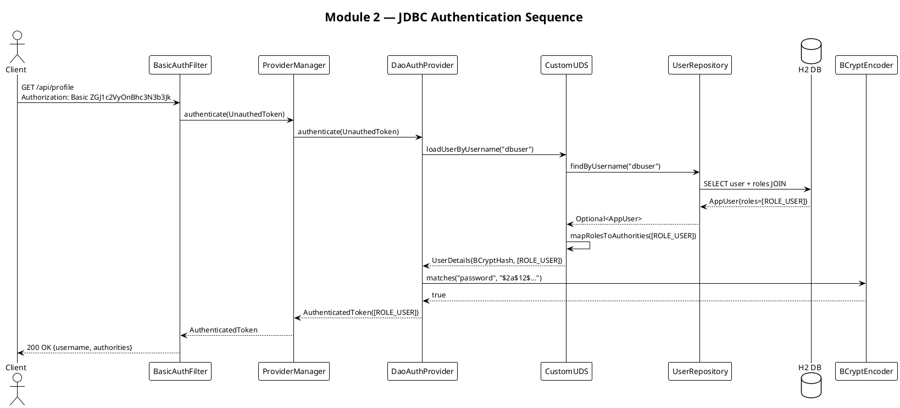

</details>

---

## 6. Module 3 — JWT Authentication

**Location:** `module3-jwt-auth/` | **Port:** `8083`

### Concepts Covered
- JWT structure, signing, and validation
- Custom `JwtAuthenticationFilter` (OncePerRequestFilter)
- Stateless session management
- Access token + refresh token pattern
- CSRF disabled rationale for JWT APIs

### JWT Token Structure

```
eyJhbGciOiJIUzI1NiIsInR5cCI6IkpXVCJ9    <- HEADER (Base64URL)
.
eyJzdWIiOiJqd3R1c2VyIiwiaWF0IjoxNzEwMDAwMDAwLCJleHAiOjE3MTAwODY0MDAsInJvbGVzIjpbIlJPTEVfVVNFUiJdfQ==
                                           <- PAYLOAD (Base64URL)
.
HMACSHA256(header + "." + payload, secret) <- SIGNATURE (not Base64)

HEADER decoded:   { "alg": "HS256", "typ": "JWT" }
PAYLOAD decoded:  {
                    "sub": "jwtuser",
                    "iat": 1710000000,
                    "exp": 1710086400,
                    "roles": ["ROLE_USER"]
                  }
```

### Sequence Diagram — JWT Login + Protected API Call


<details>
<summary>📐 PlantUML Source</summary>

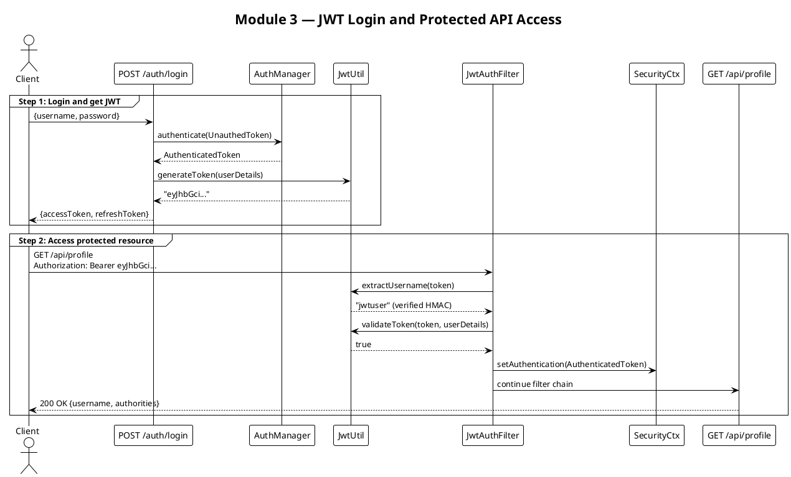

</details>

### Sequence Diagram — Invalid / Expired JWT


<details>
<summary>📐 PlantUML Source</summary>

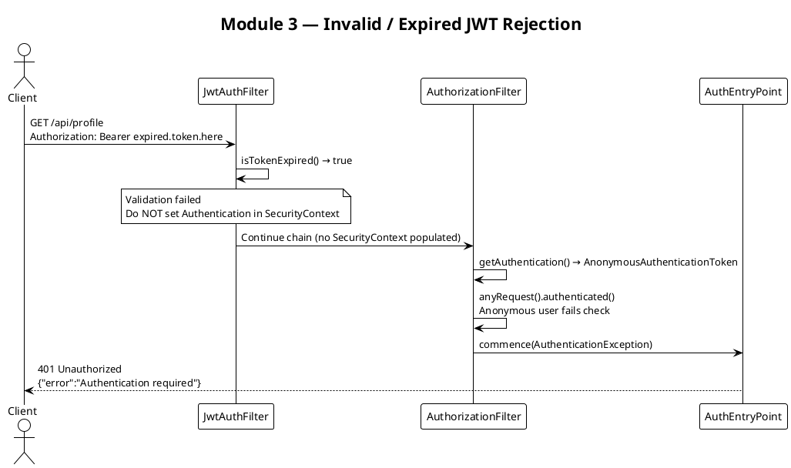

</details>

### Token Lifecycle State Diagram


<details>
<summary>📐 PlantUML Source</summary>

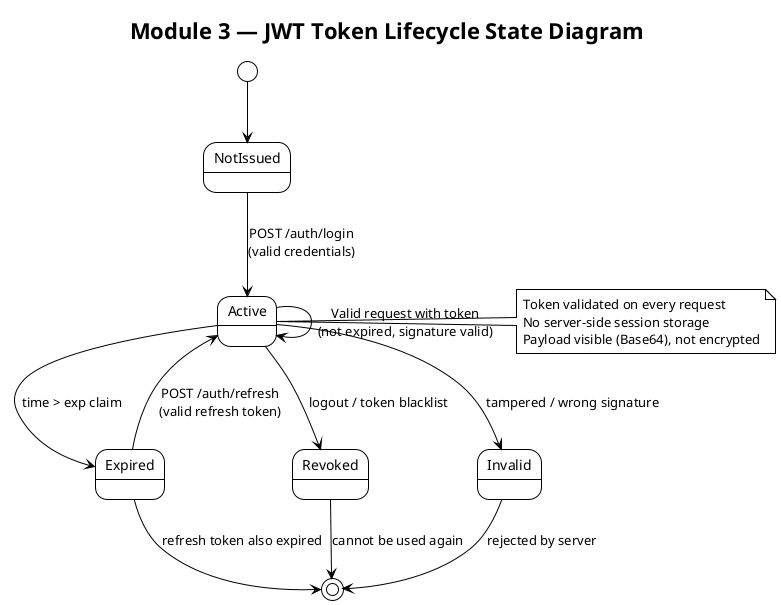

</details>

---

## 7. Module 4 — OAuth2 / OpenID Connect

**Location:** `module4-oauth2/` | **Port:** `8084`

### Concepts Covered
- OAuth2 Authorization Code Flow
- OpenID Connect (OIDC) identity layer
- `CustomOAuth2UserService` for user attribute mapping
- Multiple provider configuration (Google, GitHub)
- OAuth2 access token usage for API calls

### OAuth2 Authorization Code + PKCE Flow


<details>
<summary>📐 PlantUML Source</summary>

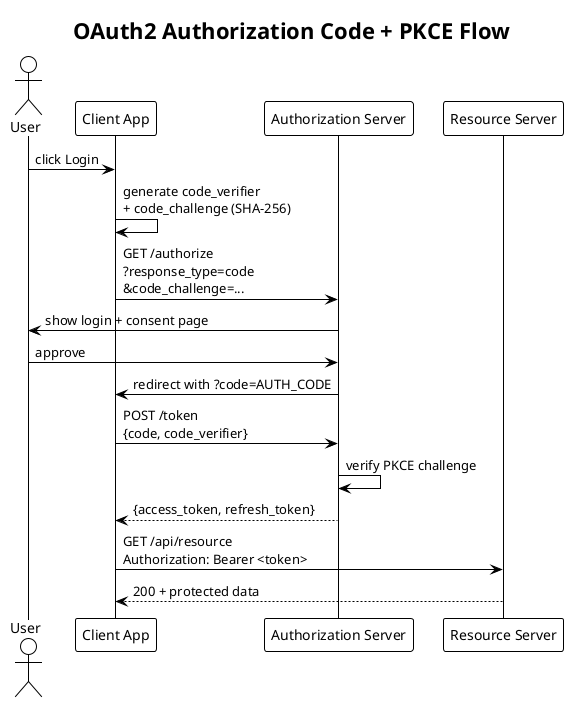

</details>

### OAuth2 Key Concepts

```
┌────────────────────────────────────────────────────────────────┐
│               OAuth2 vs OpenID Connect (OIDC)                  │
│                                                                │
│  OAuth2: "Can I access your Google Drive?" (AUTHORIZATION)    │
│  OIDC:   "Who are you?" (AUTHENTICATION)                      │
│                                                                │
│  OIDC adds:                                                    │
│  • id_token (JWT) with user identity claims                   │
│  • Standardized /userinfo endpoint                            │
│  • Standard claims: sub, name, email, picture, ...            │
│  • UserInfo endpoint for additional claims                    │
└────────────────────────────────────────────────────────────────┘
```

### OAuth2 Class Diagram


<details>
<summary>📐 PlantUML Source</summary>

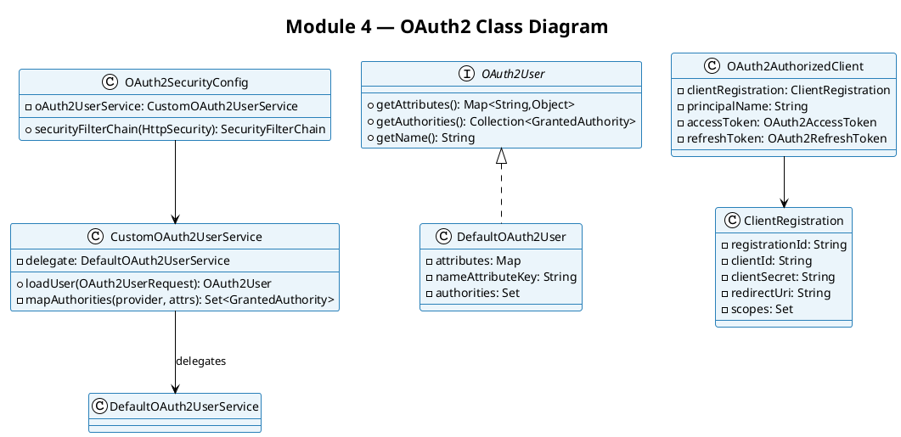

</details>

---

## 8. Module 5 — Method Security, CORS, Exception Handling

**Location:** `module5-method-security/` | **Port:** `8085`

### Concepts Covered
- `@PreAuthorize` / `@PostAuthorize` with SpEL
- `@PreFilter` / `@PostFilter` for collection filtering
- `@Secured` (role-based)
- `@RolesAllowed` (JSR-250)
- Custom `PermissionEvaluator` with `hasPermission()`
- CORS configuration
- Security exception handling (401 vs 403)

### Method Security — How AOP Works


<details>
<summary>📐 PlantUML Source</summary>

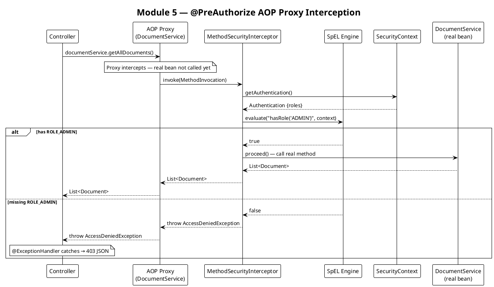

</details>

### Method Security Annotations Comparison

| Annotation | When Checked | Supports SpEL | Use Case |
|---|---|---|---|
| `@PreAuthorize` | Before call | Yes (full) | Primary recommendation |
| `@PostAuthorize` | After call | Yes (returnObj) | Check return value |
| `@PreFilter` | Before call | Yes (filterObj) | Filter input collection |
| `@PostFilter` | After call | Yes (filterObj) | Filter output list |
| `@Secured` | Before call | No | Simple role checks |
| `@RolesAllowed` | Before call | No | JSR-250 standard |

### CORS Flow Diagram


<details>
<summary>📐 PlantUML Source</summary>

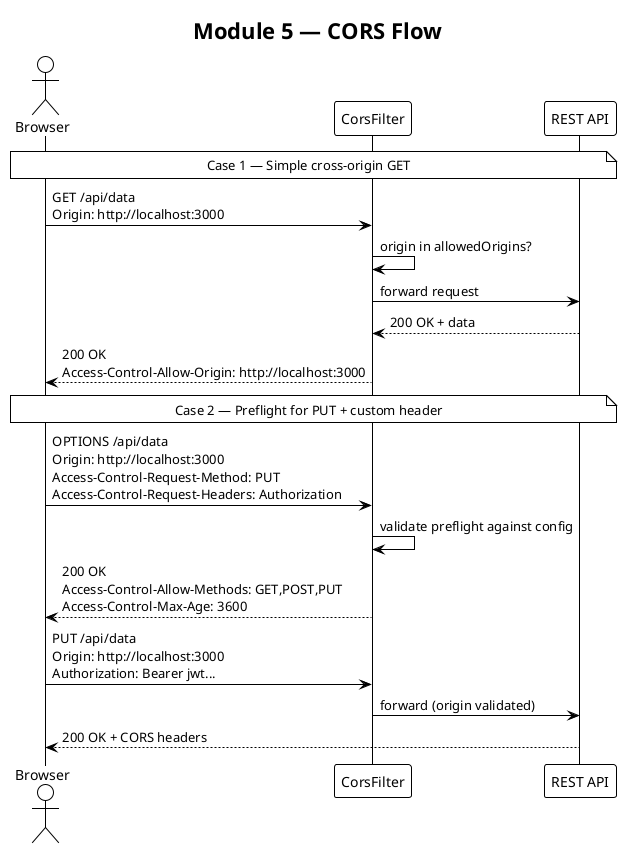

</details>

### Security Exception Flow


<details>
<summary>📐 PlantUML Source</summary>

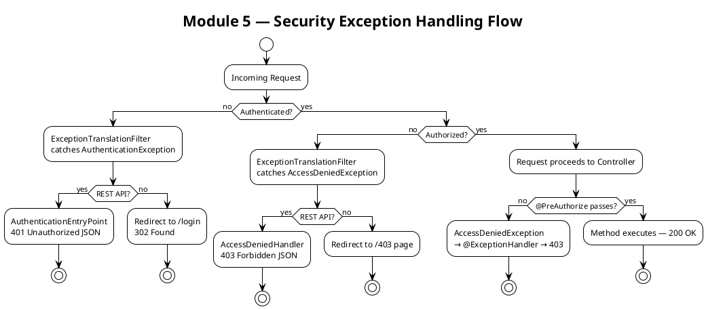

</details>

---

## 9. Module 6 — JWT Signing Algorithms, Refresh Tokens, OAuth2 Grant Types

**Port:** 8086 | **Entry:** `module6-jwt-oauth2-advanced`

### 9.1 JWT Signing Algorithms

JWTs must be signed to prevent tampering. Spring Security (via jjwt) supports three algorithms:

```
┌─────────────────────────────────────────────────────────────────────────────────┐
│                    JWT SIGNING ALGORITHM COMPARISON                              │
│                                                                                  │
│  HS256 (HMAC-SHA256) — Symmetric                                                │
│  Auth Server ──── shared secret ────▶ Resource Server                          │
│  • One key to manage                                                             │
│  • All verifiers must share the secret — risk if any service is compromised     │
│  • Use when: single service, tightly controlled microservices                   │
│                                                                                  │
│  RS256 (RSA-SHA256) — Asymmetric                                                │
│  Auth Server (private key) → sign JWT → /.well-known/jwks.json (public key)   │
│  Resource Servers (public key) → verify JWT                                     │
│  • Private key never leaves auth server                                         │
│  • Resource servers only need public key (safe to distribute)                   │
│  • Key rotation: add new pair to JWKS, old tokens still verify                  │
│  • Use when: multi-service / microservices                                       │
│                                                                                  │
│  ES256 (ECDSA P-256) — Asymmetric                                               │
│  Same asymmetric benefits as RS256 but:                                          │
│  • 256-bit EC key ≈ 3072-bit RSA security                                       │
│  • 64-byte signature vs 256-byte for RSA-2048                                   │
│  • Faster signing/verification                                                   │
│  • Use when: mobile, IoT, token-size sensitive, FIPS compliance                 │
└─────────────────────────────────────────────────────────────────────────────────┘
```

**Live Endpoints:**
| Endpoint | Description |
|---|---|
| `GET /api/jwt-demo/hs256` | Generate HS256 token + security notes |
| `GET /api/jwt-demo/rs256` | Generate RS256 token + public JWK |
| `GET /api/jwt-demo/es256` | Generate ES256 token + EC public JWK |
| `GET /api/jwt-demo/.well-known/jwks.json` | JWK Set (both RSA + EC public keys) |
| `GET /api/jwt-demo/verify/rs256?token=...` | Verify an RS256 token |
| `GET /api/jwt-demo/comparison` | Algorithm comparison table |

### 9.2 JWK Set and Key Rotation

```
Key Rotation Flow (RS256/ES256):
━━━━━━━━━━━━━━━━━━━━━━━━━━━━━━━━━━━━━━━━━━━━━━━━━━━━━━━━━━━━━━━━━━
Step 1: Normal operation
  Auth Server signs JWT with key-id="rsa-key-1"
  JWKS: { keys: [{ kid: "rsa-key-1", ... }] }

Step 2: Generate new key pair
  JWKS: { keys: [{ kid: "rsa-key-1", ... }, { kid: "rsa-key-2", ... }] }
         ↑ old key still here (old tokens still validate)

Step 3: Start signing new tokens with rsa-key-2
  JWT header: { alg: "RS256", kid: "rsa-key-2" }
  Resource servers fetch JWKS → verify with correct key by kid

Step 4: Remove old key after expiry window
  JWKS: { keys: [{ kid: "rsa-key-2", ... }] }
━━━━━━━━━━━━━━━━━━━━━━━━━━━━━━━━━━━━━━━━━━━━━━━━━━━━━━━━━━━━━━━━━━
```

### 9.3 Refresh Token Rotation with Theft Detection

```
┌─────────────────────────────────────────────────────────────────────┐
│              REFRESH TOKEN LIFECYCLE                                 │
│                                                                      │
│  1. LOGIN                                                            │
│     → ACCESS token  (15 min, JWT, stateless)                        │
│     → REFRESH token (7 days, opaque random bytes, stored in DB)     │
│     → family_id = UUID (groups all tokens for this session)         │
│                                                                      │
│  2. ACCESS TOKEN EXPIRES                                             │
│     POST /auth/refresh { refreshToken }                             │
│       a. Look up in DB                                               │
│       b. Verify: not expired, not revoked                           │
│       c. Issue NEW access token                                      │
│       d. Issue NEW refresh token (same family_id)                   │
│       e. Mark OLD refresh token as REVOKED ← ROTATION               │
│                                                                      │
│  3. THEFT DETECTION                                                  │
│     If a revoked refresh token is presented again:                   │
│       → Someone is reusing an old token                             │
│       → REVOKE the ENTIRE family → force re-login on all devices    │
│                                                                      │
│  4. LOGOUT                                                           │
│     POST /auth/logout → revoke entire family                         │
│     POST /auth/logout-all → revoke ALL families for user            │
└─────────────────────────────────────────────────────────────────────┘

Why opaque refresh tokens (not JWT)?
  JWT: cannot be revoked without a blacklist (token is self-contained)
  Opaque: just flip a DB flag → instantly invalid
```

**Sequence Diagram — Refresh Token Rotation:**


<details>
<summary>📐 PlantUML Source</summary>

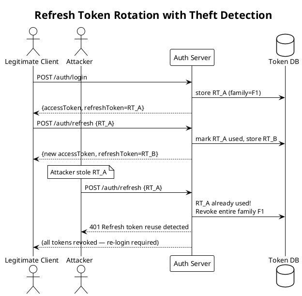

</details>

### 9.4 OAuth2 Grant Types

```
OAUTH2 GRANT TYPE DECISION TREE
━━━━━━━━━━━━━━━━━━━━━━━━━━━━━━━━━━━━━━━━━━━━━━━━━━━━━━━━━━━━━━━━━━

Is there a USER involved?
  YES ──┬── Web/Mobile app? → Authorization Code + PKCE (RFC 7636)
        │                     Required for public clients (SPA, mobile)
        │                     PKCE prevents auth code interception
        │
        └── Device without browser? → Device Authorization Grant (RFC 8628)
                                       TV, CLI, IoT: user approves on phone

  NO  → Client Credentials
        Machine-to-machine, no user
        Microservices, cron jobs, background workers

REFRESH TOKEN (not standalone — used after any user-involved flow)
  Rotate refresh tokens to detect theft

DEPRECATED (do not use):
  Implicit Grant → removed in OAuth 2.1 (token in URL fragment = exposed)
  ROPC (Resource Owner Password) → removed in OAuth 2.1 (client handles passwords)

OAuth 2.1 changes:
  • PKCE required for ALL public clients
  • Exact redirect URI matching (no wildcards)
  • Refresh token rotation required
━━━━━━━━━━━━━━━━━━━━━━━━━━━━━━━━━━━━━━━━━━━━━━━━━━━━━━━━━━━━━━━━━━
```

**Live Endpoints:**
| Endpoint | Description |
|---|---|
| `POST /auth/login` | Login: returns access + refresh tokens |
| `POST /auth/refresh` | Rotate refresh token |
| `POST /auth/logout` | Revoke token family |
| `POST /auth/logout-all` | Revoke all sessions |
| `GET /api/oauth2-guide/authorization-code-pkce` | PKCE flow guide |
| `GET /api/oauth2-guide/client-credentials` | M2M guide |
| `GET /api/oauth2-guide/device-code` | Device flow guide |
| `GET /api/oauth2-guide/deprecated-grants` | Why implicit/ROPC removed |
| `GET /api/oauth2-guide/all-grants-summary` | Quick reference |

---

## 10. Module 7 — Advanced Security

**Port:** 8087 | **Entry:** `module7-advanced-security`

### 10.1 Custom AuthenticationProvider

```
ProviderManager (implements AuthenticationManager)
  │
  ├── CustomAuthenticationProvider  ← our custom provider
  │     ├── supports(UsernamePasswordAuthenticationToken.class) → true
  │     ├── loadUserByUsername(username)
  │     ├── passwordEncoder.matches(raw, encoded)
  │     └── bruteForceProtectionService.recordFailedAttempt / recordSuccess
  │
  └── (other providers can be chained in sequence)

Why extend AuthenticationProvider?
  • Add business rules before/after authentication
  • Integrate with external identity sources (LDAP, Active Directory)
  • Support custom token types (OTP, API key, certificate)
  • Wrap standard auth with additional checks (brute force, MFA, IP whitelist)
```

### 10.2 Brute Force Protection State Machine


<details>
<summary>📐 PlantUML Source</summary>

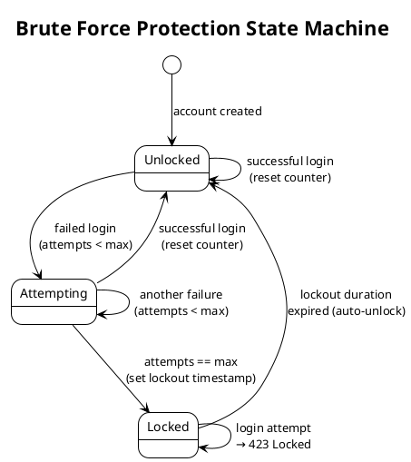

</details>

**Configuration (application.properties):**
```properties
security.max-login-attempts=5
security.lockout-duration-minutes=15
```

### 10.3 Role Hierarchy


<details>
<summary>📐 PlantUML Source</summary>

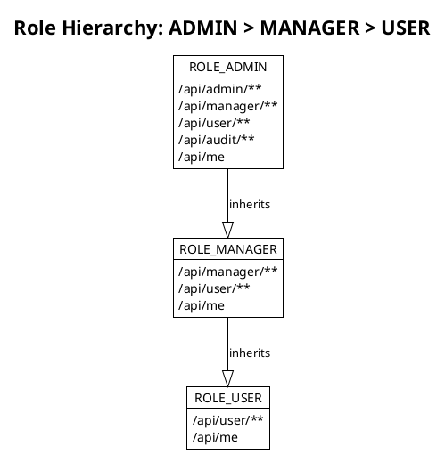

</details>

**Key Spring Security 6.2 limitation:** `hasRole()` in `authorizeHttpRequests()` does NOT auto-apply role hierarchy. Only `@PreAuthorize` with an explicit `MethodSecurityExpressionHandler` bean does.

```java
@Bean
public RoleHierarchy roleHierarchy() {
    RoleHierarchyImpl h = new RoleHierarchyImpl();
    h.setHierarchy("ROLE_ADMIN > ROLE_MANAGER\nROLE_MANAGER > ROLE_USER");
    return h;
}

@Bean
public MethodSecurityExpressionHandler methodSecurityExpressionHandler(RoleHierarchy h) {
    DefaultMethodSecurityExpressionHandler handler = new DefaultMethodSecurityExpressionHandler();
    handler.setRoleHierarchy(h);
    return handler;
}
```

### 10.4 Security Headers

| Header | Value | Protects Against |
|---|---|---|
| `Strict-Transport-Security` | `max-age=31536000; includeSubDomains` | SSL stripping, MITM |
| `Content-Security-Policy` | `default-src 'self'` | XSS, data injection |
| `X-Frame-Options` | `DENY` | Clickjacking |
| `X-Content-Type-Options` | `nosniff` | MIME sniffing |
| `Referrer-Policy` | `strict-origin-when-cross-origin` | Referrer leakage |
| `Permissions-Policy` | `camera=(), microphone=()` | Feature abuse |

```java
http.headers(h -> h
    .httpStrictTransportSecurity(hsts -> hsts.maxAgeInSeconds(31536000).includeSubDomains(true))
    .frameOptions(f -> f.deny())
    .contentTypeOptions(c -> {})
    .referrerPolicy(r -> r.policy(STRICT_ORIGIN_WHEN_CROSS_ORIGIN))
    .permissionsPolicy(p -> p.policy("camera=(), microphone=()"))
)
```

### 10.5 Security Events and Audit Logging


<details>
<summary>📐 PlantUML Source</summary>

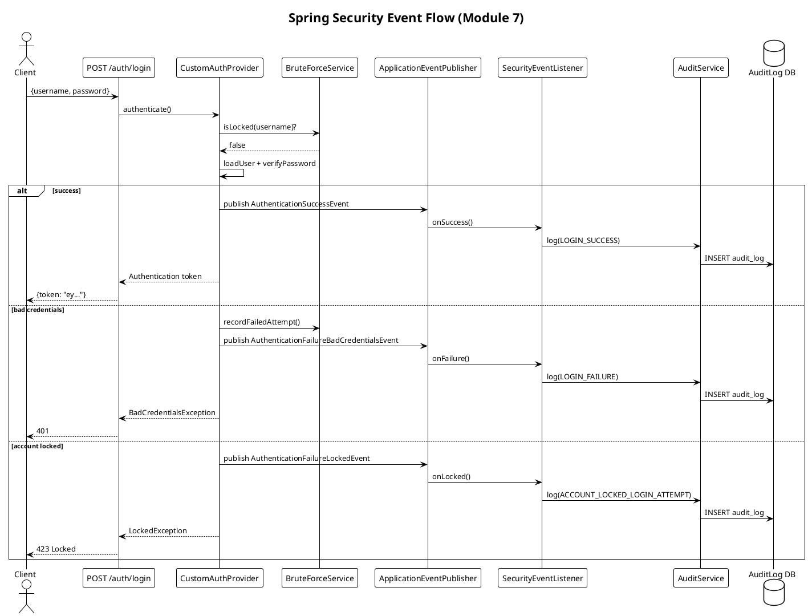

</details>

**Key Spring Security events:**
| Event | When fired |
|---|---|
| `AuthenticationSuccessEvent` | Login succeeded |
| `AuthenticationFailureBadCredentialsEvent` | Wrong password / unknown user |
| `AuthenticationFailureLockedEvent` | Account is locked |
| `AuthenticationFailureDisabledEvent` | Account is disabled |
| `AuthenticationFailureExpiredEvent` | Credentials/account expired |

### 10.6 @AuthenticationPrincipal

```java
// Old way — verbose, couples to security infrastructure:
Authentication auth = SecurityContextHolder.getContext().getAuthentication();
UserDetails user = (UserDetails) auth.getPrincipal();

// New way — clean, declarative, works with @WithMockUser in tests:
@GetMapping("/api/me")
public ResponseEntity<?> profile(@AuthenticationPrincipal UserDetails currentUser) {
    return ResponseEntity.ok(Map.of("username", currentUser.getUsername()));
}

// Custom UserDetails:
@GetMapping("/api/me")
public ResponseEntity<?> profile(@AuthenticationPrincipal CustomUser user) {
    return ResponseEntity.ok(user.getFullName()); // cast to your type
}

// SpEL for anonymous-safe access:
public ResponseEntity<?> data(@AuthenticationPrincipal(
    expression = "#this == 'anonymousUser' ? null : principal") UserDetails user) {
```

### 10.7 Password Policy

The `PasswordPolicyService` enforces NIST SP 800-63B guidelines:
- Minimum 8 characters (up to 72 for bcrypt)
- At least one uppercase, lowercase, digit, special character
- Cannot contain username
- Cannot be a common password (top 15 checked)
- No three sequential identical or ascending/descending characters
- Strength score (0–5)

**Endpoint:** `POST /api/public/password-check` — public, no auth required.

### 10.8 ACL (Access Control Lists) — Conceptual Guide

ACL provides **domain object security** — per-object, per-user permissions beyond RBAC:

```
RBAC (Role-Based):        hasRole("ADMIN") → can access ALL documents
ACL (Object-Based):       Alice can READ document 123
                          Bob can READ + WRITE document 123
                          Carol is OWNER of document 123 (READ + WRITE + DELETE)

Spring Security ACL tables:
  acl_class          — maps Java class to numeric ID
  acl_sid            — maps principal/role to numeric ID
  acl_object_identity — maps each object instance to class + object ID
  acl_entry          — the permission entries (who, what object, what permission)

Usage:
  @PreAuthorize("hasPermission(#doc, 'READ')")
  public Document getDocument(Document doc) { ... }
```

See `GET /api/public/concepts/acl` for a full implementation guide.

**Live Endpoints (Module 7):**
| Endpoint | Auth Required | Description |
|---|---|---|
| `POST /auth/login` | None | Login with brute force protection |
| `GET /api/me` | Any | @AuthenticationPrincipal demo |
| `GET /api/user/data` | USER+ | Role hierarchy: USER/MANAGER/ADMIN |
| `GET /api/manager/dashboard` | MANAGER+ | Role hierarchy: MANAGER/ADMIN |
| `GET /api/admin/dashboard` | ADMIN | Admin only |
| `GET /api/audit/recent` | ADMIN | Security audit log |
| `POST /api/public/password-check` | None | Password policy check |
| `GET /api/public/concepts/role-hierarchy` | None | Role hierarchy guide |
| `GET /api/public/concepts/security-headers` | None | Security headers guide |
| `GET /api/public/concepts/brute-force-protection` | None | Brute force strategies |
| `GET /api/public/concepts/acl` | None | ACL implementation guide |
| `GET /api/public/concepts/session-management` | None | Session management guide |
| `GET /api/public/concepts/authentication-principal` | None | @AuthenticationPrincipal guide |

---

## 11. Security State Diagram

Full security lifecycle for a request:


<details>
<summary>📐 PlantUML Source</summary>

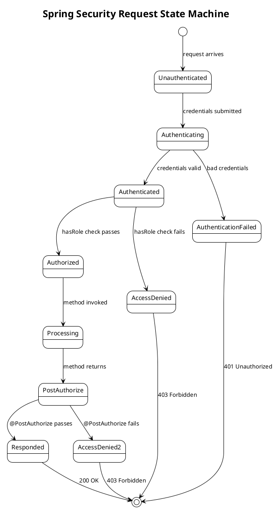

</details>

---

## 12. CSRF Protection

```
┌────────────────────────────────────────────────────────────────────────────┐
│                        CSRF ATTACK EXPLAINED                                │
│                                                                             │
│  1. User logs into bank.com — browser stores session cookie                 │
│  2. User visits evil.com (attacker's site)                                  │
│  3. evil.com has hidden form: <form action="https://bank.com/transfer">    │
│  4. Form auto-submits (JS or img tag trick)                                 │
│  5. Browser sends request to bank.com WITH the session cookie               │
│  6. Bank's server sees valid session → processes transfer!                  │
│                                                                             │
│  WHY cookies are vulnerable: browsers auto-send cookies for every request  │
│  to the matching domain, even from other websites.                          │
│                                                                             │
│                    CSRF PROTECTION (Spring Security)                        │
│                                                                             │
│  1. Server generates unique CSRF token per session                          │
│  2. Token embedded in every HTML form: <input name="_csrf" value="..."/>   │
│  3. Or sent in cookie: XSRF-TOKEN (for JS frameworks)                      │
│  4. Client must include token in POST/PUT/DELETE requests                   │
│  5. Server validates token — evil.com can't forge it (cross-origin)        │
│                                                                             │
│  WHEN TO DISABLE CSRF:                                                      │
│  ✓ Stateless REST APIs (JWT in Authorization header, not cookie)           │
│  ✗ Web applications with form-based login (NEVER disable)                  │
│  ✗ APIs that accept cookies for authentication                              │
└────────────────────────────────────────────────────────────────────────────┘
```

---

## 13. Password Encoding

```
┌────────────────────────────────────────────────────────────────────────────┐
│                    PASSWORD ENCODING BEST PRACTICES                         │
│                                                                             │
│  NEVER:  Store plaintext, MD5, SHA-1, SHA-256 without salt                 │
│  ALWAYS: Use adaptive hashing: BCrypt, Argon2, SCrypt                      │
│                                                                             │
│  BCrypt (recommended, default in Spring Security):                         │
│  ┌────────────────────────────────────────────────────────────────────┐    │
│  │ Input: "password"                                                   │    │
│  │ BCrypt(strength=12, random_salt):                                   │    │
│  │ "$2a$12$N9qo8uLOickgx2ZMRZoMyeIjZAgcfl7p92ldGxad68LJZdL17lhWy"  │    │
│  │                                                                     │    │
│  │ Format: $2a$  12  $  SALT(22chars)  HASH(31chars)                  │    │
│  │          ↑    ↑      ↑               ↑                             │    │
│  │       version cost  random salt     actual hash                    │    │
│  │                                                                     │    │
│  │ Same input DIFFERENT output (random salt each time)                │    │
│  │ BCrypt("password") → "$2a$12$abc..." (different salt!)             │    │
│  │                                                                     │    │
│  │ Verification: passwordEncoder.matches("password", storedHash)      │    │
│  │   → extracts salt from stored hash → re-hashes → compares          │    │
│  └────────────────────────────────────────────────────────────────────┘    │
│                                                                             │
│  Work factor (strength) selection:                                          │
│  • Too low: fast to crack (GPU brute force)                                │
│  • Too high: slow login (user experience degrades)                         │
│  • Recommendation: choose strength where hashing takes ~100-300ms           │
│  • Benchmark: new BCryptPasswordEncoder(12); — adjust as hardware changes  │
│                                                                             │
│  Password Encoder Delegation (Spring 5+):                                  │
│  DelegatingPasswordEncoder supports multiple algorithms simultaneously:     │
│  {bcrypt}$2a$10$...   ← BCrypt encoded                                    │
│  {noop}password        ← Plaintext (dev only, never production!)           │
│  {pbkdf2}...           ← PBKDF2 encoded                                   │
└────────────────────────────────────────────────────────────────────────────┘
```

---

## 14. Quick Reference

### SecurityFilterChain — Common Patterns

```java
// Permit all (public)
.requestMatchers("/public/**").permitAll()

// Require specific role
.requestMatchers("/admin/**").hasRole("ADMIN")

// Require specific authority (exact string)
.requestMatchers("/write/**").hasAuthority("WRITE")

// Multiple roles (any one)
.requestMatchers("/ops/**").hasAnyRole("ADMIN", "MANAGER")

// Require authentication (any role)
.anyRequest().authenticated()
```

### Method Security — SpEL Cheat Sheet

```java
// Role check
@PreAuthorize("hasRole('ADMIN')")

// Multiple roles
@PreAuthorize("hasAnyRole('ADMIN', 'MANAGER')")

// Authority check (exact)
@PreAuthorize("hasAuthority('READ')")

// Use method parameter
@PreAuthorize("#username == authentication.name")

// Complex expression
@PreAuthorize("hasRole('ADMIN') or #doc.owner == authentication.name")

// Check return value
@PostAuthorize("returnObject.owner == authentication.name")

// Filter collection
@PostFilter("filterObject.owner == authentication.name")

// Call a Spring bean
@PreAuthorize("@myBean.customCheck(authentication, #id)")
```

### Session vs. Stateless

```java
// Stateful (form login, web apps)
.sessionManagement(s -> s.sessionCreationPolicy(SessionCreationPolicy.IF_REQUIRED))

// Stateless (JWT, REST APIs)
.sessionManagement(s -> s.sessionCreationPolicy(SessionCreationPolicy.STATELESS))
```

---

## 15. Running Each Module

### Prerequisites
- Java 17+
- Maven 3.8+

### Module 1 — Basic Security (Form Login)
```bash
cd module1-basic-security
mvn spring-boot:run -Dspring-boot.run.profiles=inmemory
# Open: http://localhost:8081
# Login: user/password, admin/admin123, manager/manager123
```

```bash
# HTTP Basic profile
mvn spring-boot:run -Dspring-boot.run.profiles=httpbasic
# Test: curl -u api-user:api-pass http://localhost:8081/api/user
```

### Module 2 — JDBC Auth
```bash
cd module2-jdbc-auth
mvn spring-boot:run
# Swagger: http://localhost:8082/swagger-ui.html
# H2 Console: http://localhost:8082/h2-console (jdbc:h2:mem:securitydb)
# Test: curl -u dbuser:password http://localhost:8082/api/profile
# Test: curl -u dbadmin:admin123 http://localhost:8082/api/admin/users
```

### Module 3 — JWT Auth
```bash
cd module3-jwt-auth
mvn spring-boot:run
# Swagger: http://localhost:8083/swagger-ui.html

# Step 1: Login
curl -X POST http://localhost:8083/auth/login \
  -H "Content-Type: application/json" \
  -d '{"username":"jwtuser","password":"password"}'

# Step 2: Use the accessToken
curl http://localhost:8083/api/profile \
  -H "Authorization: Bearer <accessToken>"
```

### Module 4 — OAuth2
```bash
cd module4-oauth2
# First: configure client-id and client-secret in application.properties
# (Register app at Google Console or GitHub Developer Settings)
mvn spring-boot:run
# Open: http://localhost:8084
# Click "Login with Google" or "Login with GitHub"
```

### Module 5 — Method Security
```bash
cd module5-method-security
mvn spring-boot:run
# Swagger: http://localhost:8085/swagger-ui.html
# Test admin:
curl -u admin:pass http://localhost:8085/api/documents
# Test user (403 - @PreAuthorize blocks it):
curl -u user:pass http://localhost:8085/api/documents
# Test user's own docs (@PostFilter):
curl -u user:pass http://localhost:8085/api/documents/my
```

### Module 6 — JWT Signing, Refresh Tokens, OAuth2 Grant Types
```bash
cd module6-jwt-oauth2-advanced
mvn spring-boot:run
# Swagger: http://localhost:8086/swagger-ui.html

# Login to get tokens:
curl -s -X POST http://localhost:8086/auth/login \
  -H 'Content-Type: application/json' \
  -d '{"username":"alice","password":"pass123"}' | jq .

# View JWT signing algorithm demos:
curl http://localhost:8086/api/jwt-demo/hs256 | jq .
curl http://localhost:8086/api/jwt-demo/rs256 | jq .
curl http://localhost:8086/api/jwt-demo/es256 | jq .

# JWKS endpoint:
curl http://localhost:8086/api/jwt-demo/.well-known/jwks.json | jq .

# OAuth2 grant type guides (no auth needed):
curl http://localhost:8086/api/oauth2-guide/authorization-code-pkce | jq .
curl http://localhost:8086/api/oauth2-guide/client-credentials | jq .
curl http://localhost:8086/api/oauth2-guide/device-code | jq .
curl http://localhost:8086/api/oauth2-guide/deprecated-grants | jq .
```

### Module 7 — Advanced Security
```bash
cd module7-advanced-security
mvn spring-boot:run
# Swagger: http://localhost:8087/swagger-ui.html

# Login (with brute force protection):
curl -s -X POST http://localhost:8087/auth/login \
  -H 'Content-Type: application/json' \
  -d '{"username":"alice","password":"Alice@1234"}' | jq .

# Store the token:
TOKEN=$(curl -s -X POST http://localhost:8087/auth/login \
  -H 'Content-Type: application/json' \
  -d '{"username":"admin","password":"Admin@1234"}' | jq -r .token)

# @AuthenticationPrincipal demo:
curl -H "Authorization: Bearer $TOKEN" http://localhost:8087/api/me | jq .

# Role hierarchy: admin can access manager endpoint:
curl -H "Authorization: Bearer $TOKEN" http://localhost:8087/api/manager/dashboard | jq .

# Password policy check (no auth needed):
curl -s -X POST http://localhost:8087/api/public/password-check \
  -H 'Content-Type: application/json' \
  -d '{"password":"weak","username":"alice"}' | jq .

# Security concept guides:
curl http://localhost:8087/api/public/concepts/role-hierarchy | jq .
curl http://localhost:8087/api/public/concepts/security-headers | jq .
curl http://localhost:8087/api/public/concepts/brute-force-protection | jq .
curl http://localhost:8087/api/public/concepts/acl | jq .

# Audit log (ADMIN only):
curl -H "Authorization: Bearer $TOKEN" http://localhost:8087/api/audit/recent | jq .
```

### Run All Tests
```bash
# From parent directory (skips OAuth2 module which needs a real provider):
mvn test -pl !module4-oauth2
```

### Build All Modules
```bash
# Skip OAuth2 module tests (needs real provider):
mvn clean package -pl !module4-oauth2
```

---

## Project Structure

```
spring-security-learning/
├── pom.xml                          ← Parent POM
├── README.md                        ← This file
│
├── module1-basic-security/          ← Form Login + HTTP Basic
│   ├── config/InMemorySecurityConfig.java
│   ├── config/HttpBasicSecurityConfig.java
│   └── controller/HomeController.java
│
├── module2-jdbc-auth/               ← Database auth + UserDetailsService
│   ├── entity/{AppUser,Role}.java
│   ├── repository/{User,Role}Repository.java
│   ├── service/CustomUserDetailsService.java
│   └── config/{SecurityConfig,DataInitializer}.java
│
├── module3-jwt-auth/                ← JWT stateless authentication
│   ├── util/JwtUtil.java
│   ├── filter/JwtAuthenticationFilter.java
│   ├── controller/AuthController.java
│   └── config/SecurityConfig.java
│
├── module4-oauth2/                  ← OAuth2 / OpenID Connect
│   ├── config/OAuth2SecurityConfig.java
│   └── service/CustomOAuth2UserService.java
│
├── module5-method-security/         ← @PreAuthorize, CORS, Exceptions
│   ├── service/DocumentService.java
│   ├── service/DocumentPermissionEvaluator.java
│   ├── config/MethodSecurityConfig.java
│   └── exception/SecurityExceptionHandler.java
│
├── module6-jwt-oauth2-advanced/     ← JWT signing, Refresh tokens, OAuth2 grant types
│   ├── util/{AccessTokenUtil,JwtSigningUtil}.java
│   ├── service/RefreshTokenService.java       ← rotation + theft detection
│   ├── entity/RefreshToken.java
│   ├── controller/{TokenController,JwtSigningDemoController,OAuth2GrantTypesController}.java
│   └── filter/JwtAuthFilter.java
│
└── module7-advanced-security/       ← Brute force, role hierarchy, security headers, audit
    ├── provider/CustomAuthenticationProvider.java
    ├── service/{BruteForceProtectionService,AuditService,PasswordPolicyService}.java
    ├── event/SecurityEventListener.java
    ├── entity/{User,AuditEvent}.java
    ├── config/{SecurityConfig,PasswordEncoderConfig,DataInitializer}.java
    └── controller/{AuthController,UserController,AuditController,SecurityConceptsController}.java
```
